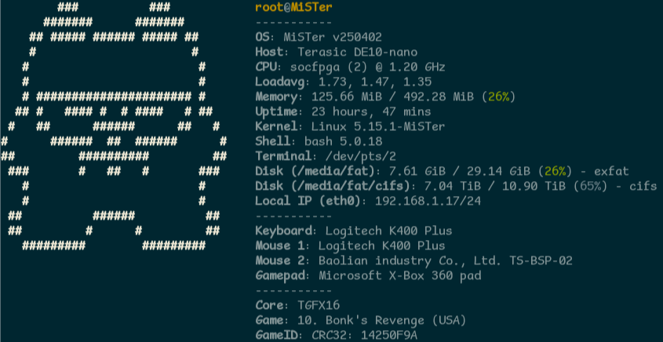

# MiSTer-fastfetch

A script for installing and running [fastfetch](https://github.com/fastfetch-cli/fastfetch)
on your MiSTer.

## Prerequisites

* A network connected MiSTer (Ethernet or wifi)
* Set `log_file_entry=1` in `MiSTer.ini` to show the currently loaded game

## Setup

1. Add the following to `/media/fat/downloader.ini`.

```ini
[davewongillies/mister-fastfetch]
db_url = https://raw.githubusercontent.com/davewongillies/MiSTer-fastfetch/db/db.json.zip
```

2. Run `update` or `update_all` from the Scripts menu.

## Running fastfetch

1. On your MiSTer run `fastfetch` from the `Scripts` menu or `fastfetch.sh`
   from a shell on your MiSTer.

## Configuration

By default `fastfetch.sh` will look for the configuration file `/media/fat/Scripts/.config/mister.jsonc`.
If the file doesn't exist `fastfetch.sh` will copy the file `mister_stock.jsonc`.
After that you are free to modify the file as you see fit with standard fastfetch
[configuration](https://github.com/fastfetch-cli/fastfetch/wiki/Configuration)
syntax.

If you want `fastfetch` to run everytime you login via ssh or a terminal, run
the following:

```bash
ln -s /media/fat/Scripts/fastfetch.sh /etc/profile.d/
```

## Example output



## Credits

* MiSTer-kun Cat by hewhoisred
* ASCII art version of MiSTer-kun Cat generated from [baxysquare/mister\_kun](https://github.com/baxysquare/mister_kun/blob/main/8-bit_mister_kun_bw_32x32.png)
